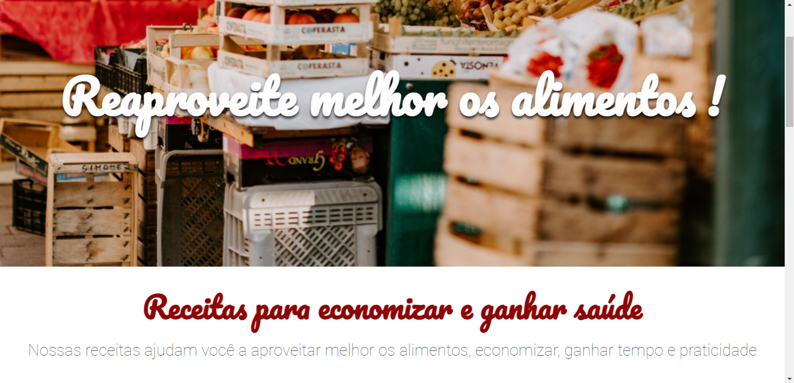

# Arquitetura-CSS
**Alura** CSS course ministred by **Matheus Henrique Castiglioni**: <a href="https://cursos.alura.com.br/course/arquitetura-css" target="_blank"> Click here to Access </a>

# Site Preview

### [Figma project link](https://www.figma.com/file/0gMF5BPgplPYqQA6Om1T1sk9/alura-bootstrap?node-id=0%3A1&t=wFMuO88msLJMevhP-0;)

# Course Idea 
  > In this course were going build the "Alura Fruta & Fruto" page, that page contains recipes for better alimentation
  > of course we want to do this using new concepts of CSS arquiteture and CSS nomeclatures to improve the future refactoring experience

# Major Knowledges
  - Atomic Design
  - BEM methodology
  
